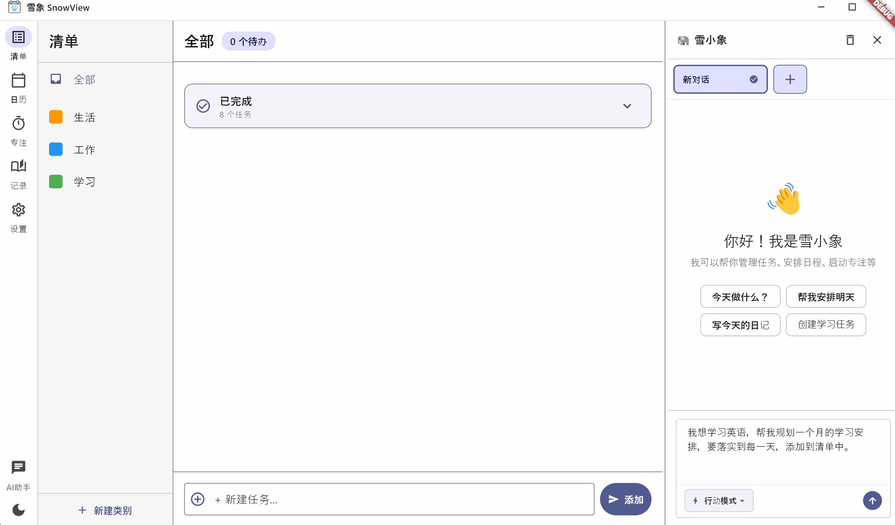
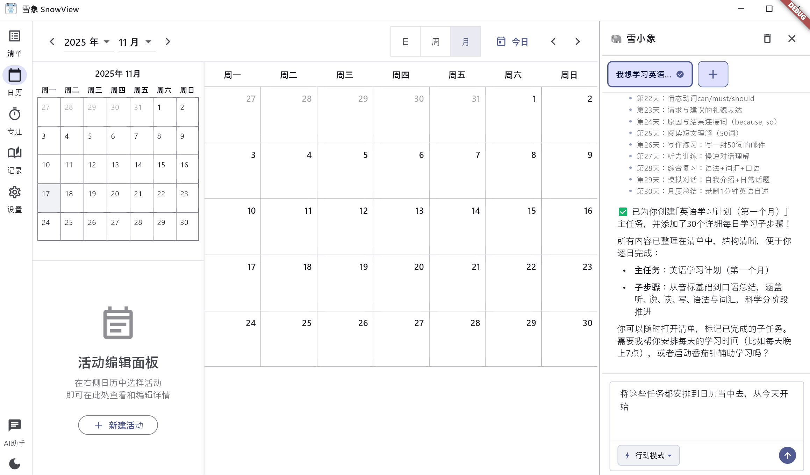
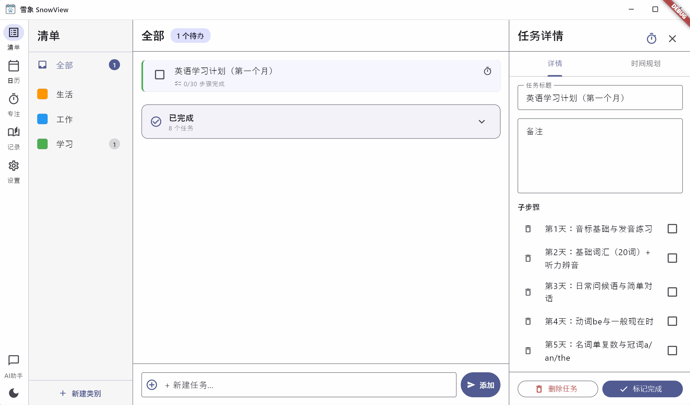
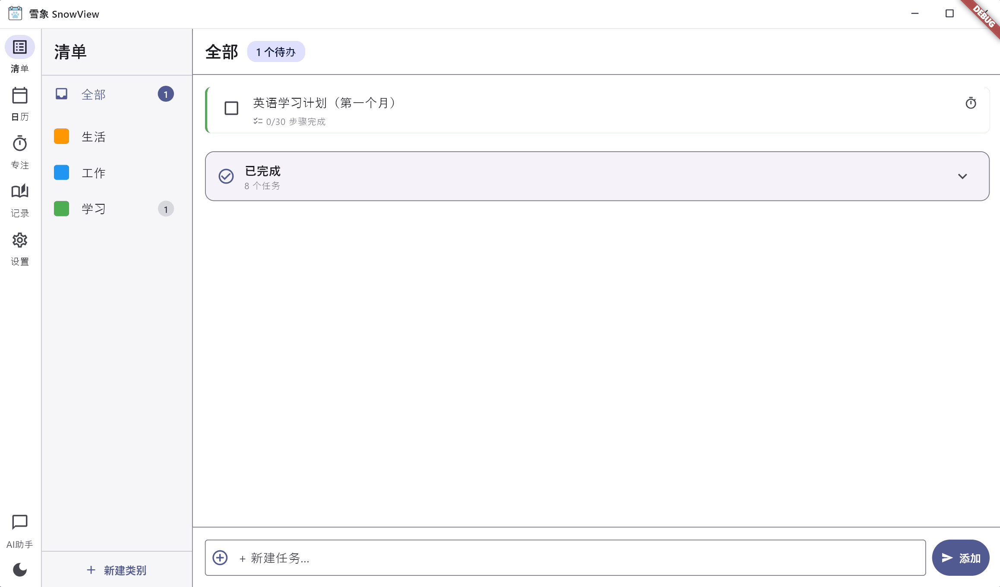
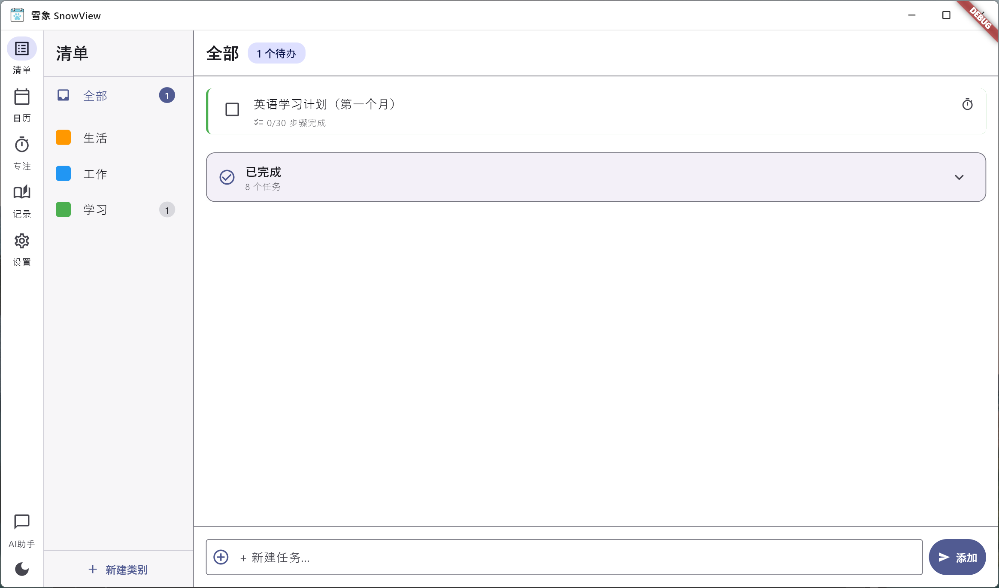
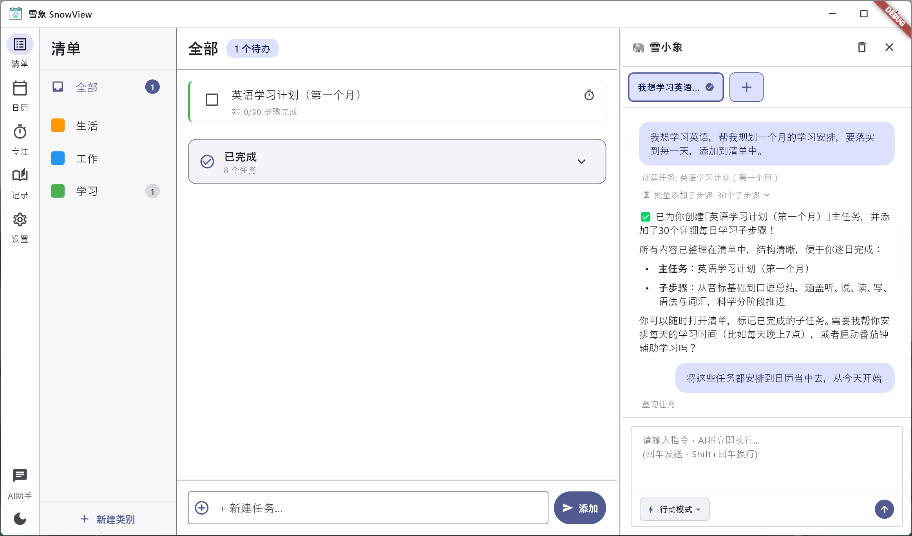
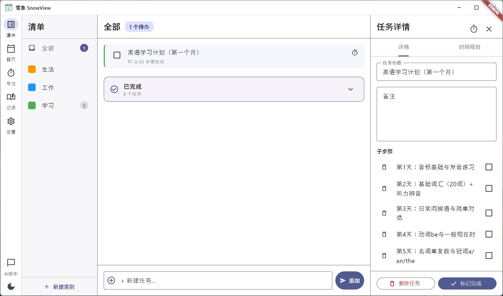
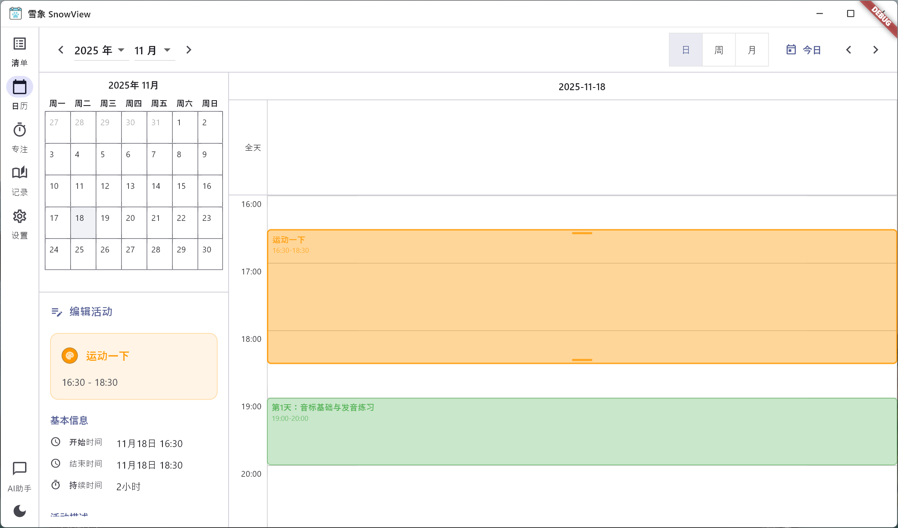
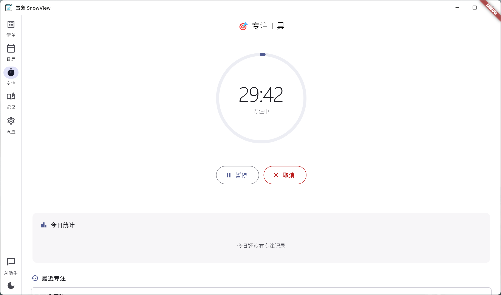
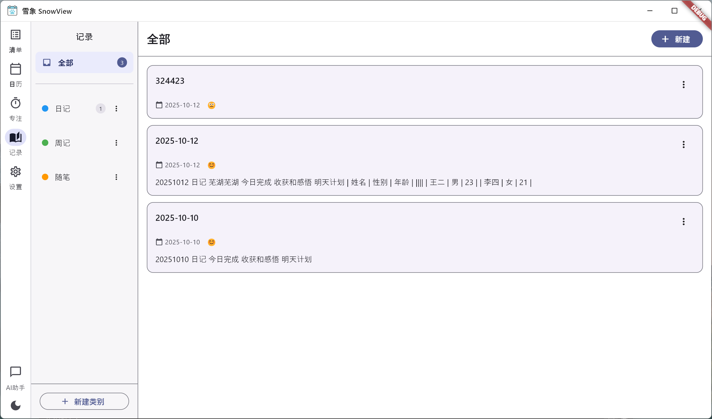

# 雪象 SnowView

<div align="center">


**基于 AI 辅助的智能日程规划和专注工具**

[](https://flutter.dev)
[](LICENSE)
[]()

</div>

## 📖 项目简介

雪象是一款现代化的桌面端应用程序，旨在帮助用户高效管理任务、提升专注力。通过集成 AI 助手和智能算法，优化时间分配，实现个人目标的高效达成。

## 💡 设计理念

雪象的核心设计遵循「**规划 → 执行 → 专注 → 记录**」的完整工作流程：

### 📋 任务清单 - 规划起点
通过清单功能，你可以灵活地创建和管理任务，支持任务分类、子任务拆解、优先级设置。这是一切规划的起点。

### 📅 智能日历 - 落实执行
将清单中的任务真正分配到日历的具体时间段，从"想做什么"转变为"什么时候做"。这是从计划到执行的关键一步，让任务不再停留在列表中，而是真正落实到时间维度。

### ⏱️ 专注模式 - 保证专注
在执行任务时，通过番茄钟计时器和白噪音功能，帮助你保持专注，避免分心，提升工作效率。

### 📝 每日记录 - 复盘总结
记录每天的工作进展、心得体会和经验总结，形成个人的知识库和成长轨迹。

### 🤖 AI 智能助手 - 核心驱动
最重要的是，AI 可以：
- **智能规划任务**：根据你的需求自动生成任务清单
- **任务分解**：将复杂任务拆解为可执行的小步骤
- **时间分配**：根据任务优先级和你的时间安排，智能地将任务分配到日历中
- **个性化建议**：基于你的工作习惯提供优化建议

通过这套完整的工作流，雪象帮助你从「想到」到「做到」，真正实现高效的时间管理和目标达成。

## ✨ 功能特性

- 🤖 **AI 智能助手**：集成 OpenAI，支持自然语言交互，智能规划任务和日程
- 📋 **任务清单管理**：灵活的任务分类、子任务、优先级管理
- 📅 **智能日历**：可视化日程安排，AI 自动分配时间
- ⏱️ **专注模式**：番茄钟计时器，白噪音支持，专注统计
- 📝 **每日记录**：记录工作学习进展，分类管理
- 🎨 **现代化 UI**：Material Design 3，流畅动画
- 🌙 **深色模式**：支持浅色/深色主题自动切换
- 💾 **本地存储**：所有数据本地存储，保护隐私

## 📸 应用演示

### 🎬 功能演示动画

#### AI 智能助手 - 自动规划任务
<div align="center">

<p><i>AI 根据你的需求自动生成任务清单并分解步骤</i></p>
</div>

#### 任务分配到日历
<div align="center">

<p><i>让AI将任务添加到日程当中，真正落实到时间维度</i></p>
</div>

#### 专注模式运行中
<div align="center">

<p><i>选择任务开启番茄钟，保持高效专注</i></p>
</div>

#### 主题切换效果
<div align="center">

<p><i>流畅的深色/浅色主题切换动画</i></p>
</div>

---

### 📷 界面截图

#### 主界面
<div align="center">

</div>

#### AI 智能助手
<div align="center">

<p><i>自然语言交互，智能规划任务和日程</i></p>
</div>

#### 任务清单管理
<div align="center">

<p><i>灵活的任务分类、子任务、优先级管理</i></p>
</div>

#### 智能日历
<div align="center">

<p><i>可视化日程安排，将任务落实到具体时间段</i></p>
</div>

#### 专注模式
<div align="center">

<p><i>番茄钟计时器，保持高效专注</i></p>
</div>

#### 每日记录
<div align="center">

<p><i>记录工作进展和心得体会</i></p>
</div>

## 🏗️ 技术架构
```
lib/
├── core/                    # 核心模块
│   ├── constants/          # 常量定义
│   ├── errors/             # 错误处理
│   ├── theme/              # 主题配置
│   └── utils/              # 工具类
├── data/                   # 数据层
│   ├── datasources/        # 数据源
│   ├── models/             # 数据模型
│   └── repositories/       # 数据仓库实现
├── domain/                 # 业务逻辑层
│   ├── entities/           # 业务实体
│   ├── repositories/       # 仓库接口
│   └── usecases/           # 用例
├── presentation/           # 表现层
│   ├── screens/            # 页面
│   ├── widgets/            # 组件
│   └── providers/          # 状态管理
└── services/               # 服务层
    ├── database_service.dart
    ├── ai_service.dart
    ├── schedule_service.dart
    ├── focus_service.dart
    ├── notification_service.dart
    └── storage_service.dart
```

## 🛠️ 技术栈

| 类别 | 技术 |
|------|------|
| **开发框架** | Flutter 3.9.2+ |
| **编程语言** | Dart 3.0+ |
| **状态管理** | Provider |
| **本地数据库** | Hive (NoSQL), SQLite |
| **AI 服务** | OpenAI API (GPT-4) |
| **桌面集成** | window_manager |
| **通知服务** | flutter_local_notifications |
| **网络请求** | http, dio |
| **音频播放** | audioplayers |

## 💻 支持平台

- ✅ Windows 10/11
- ✅ macOS 10.14+
- ✅ Linux (Ubuntu 20.04+)

## 🚀 快速开始

### 环境要求

- Flutter SDK 3.9.2 或更高版本
- Dart SDK 3.0 或更高版本

### 安装步骤

1. **克隆项目**
```bash
git clone https://github.com/langxke/snowview.git
cd snowview
```

2. **安装依赖**
```bash
flutter pub get
```

3. **运行应用**
```bash
# Windows
flutter run -d windows

# macOS
flutter run -d macos

# Linux
flutter run -d linux
```

### 配置 AI 功能

应用支持 OpenAI 兼容接口，在"设置"页面配置 API Key 和模型即可使用 AI 助手功能。

## 📦 构建发布版本

```bash
# Windows
flutter build windows --release

# macOS
flutter build macos --release

# Linux
flutter build linux --release
```

构建产物位置：
- Windows: `build/windows/x64/runner/Release/`
- macOS: `build/macos/Build/Products/Release/`
- Linux: `build/linux/x64/release/bundle/`

## 🤝 贡献

欢迎提交 Issue 和 Pull Request！

## 📄 许可证

本项目采用 [GNU General Public License v3.0 (GPL-3.0)](LICENSE) 开源协议。

这意味着：
- ⚠️ 如果您分发修改后的软件，必须公开修改后的源代码
- ⚠️ 衍生作品必须使用相同的 GPL-3.0 许可证

## ⚠️ 免责声明

- 使用 OpenAI API 可能产生费用，请自行控制使用量
- 所有数据均存储在本地，请定期备份重要数据

## 📮 联系方式

如有问题或建议，欢迎通过 [Issues](https://github.com/langxke/snowview/issues) 反馈。

---

<div align="center">

**⭐ 如果觉得项目不错，欢迎 Star ⭐**

Made with ❤️ by langxke

</div>